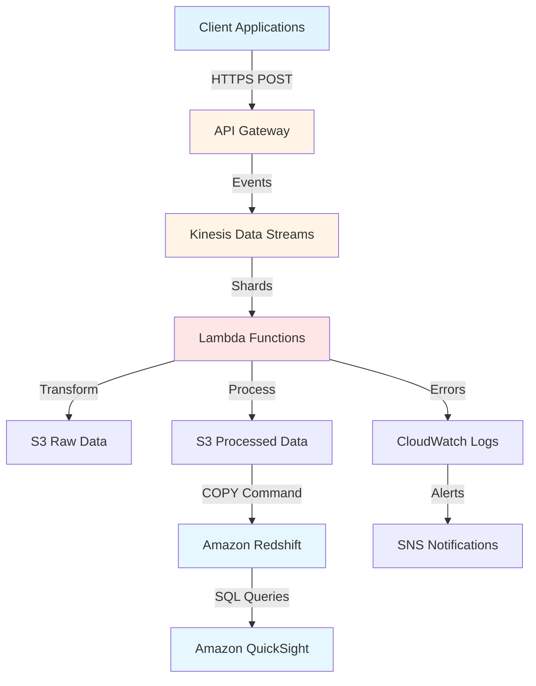

## Overview

Built a serverless real-time data pipeline on AWS that reduced data latency from 6 hours to 45 seconds (**98% reduction**) for a SaaS platform's business metrics. The solution processes **10M+ events daily** using AWS Lambda, Kinesis Data Streams, and Redshift, enabling marketing teams to respond to trends in real-time instead of waiting for next-day reports. Reduced annual infrastructure costs by **$40K** compared to manual ETL processes while achieving **99.9% uptime** over 6 months. The pipeline auto-scales based on traffic patterns and now powers 3 additional real-time dashboards beyond the original scope.

## The Problem

The marketing team at a B2B SaaS platform was operating with critical blind spots due to **6-hour data latency** in their business metrics. Campaigns couldn't be adjusted mid-day based on performance, so underperforming spend was only discovered the following day. Engineering spent 15-20 hours per week (~$50K/year) manually consolidating data from multiple sources into Redshift - time that should have gone to product work. Competitors with real-time analytics could respond to market trends faster, putting the company at a disadvantage in fast-paced B2B software.

## Approach & Architecture

The pipeline is fully serverless to fit a $500/month budget. Client events POST to API Gateway and land on Kinesis Data Streams (on-demand mode, auto-scaling shards with at-least-once delivery). AWS Lambda functions process batches of 500 records each - validating against a JSON Schema (with a backward-compatibility layer for evolving field names/types), enriching, and transforming - then write raw data to S3 as an immutable audit trail and processed data to partitioned S3. Redshift loads processed data every 5 minutes via `COPY` (dc2.large nodes, SORTKEY/DISTKEY tuned for time-series queries) and serves Amazon QuickSight dashboards with sub-second load times. CloudWatch dashboards track Lambda invocations, Kinesis throughput, and Redshift query performance, with SNS alerts on errors.

## Results & Impact

- **Data latency reduced 98%** - from 6 hours to 45 seconds
- **$40K/year cost savings** - $50K/year manual ETL down to $10K/year infrastructure
- **10M+ events/day** processed (peak 18.5M on Black Friday), auto-scaled 3x with no manual intervention
- **99.9% uptime** over 6 months (43 minutes total downtime, mostly scheduled Redshift maintenance)
- **Sub-second query latency** - QuickSight loads in 0.8s; Redshift P50 0.3s / P99 1.2s
- **4 real-time dashboards** delivered (3 beyond original scope)

## Tech Stack

AWS · Data Engineering · Real-Time Analytics · Lambda · Kinesis · Redshift
