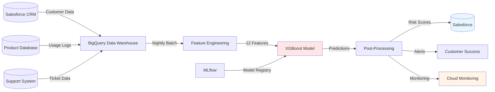

## Overview

Developed a customer churn prediction system for a SaaS subscription product, identifying at-risk customers with **85% precision** and **0.89 AUC** (vs 0.76 baseline). The system analyzes 12 behavioral features (usage frequency, engagement metrics, support interactions) to predict churn risk 30 days in advance, enabling the customer success team to prioritize retention efforts. Proactive campaigns increased customer retention by **8%** and prevented an estimated **$200K/year** in revenue attrition. Deployed as batch predictions integrated with Salesforce CRM, scoring 50K customers nightly with <1 hour processing time.

## The Problem

The Customer Success team at a B2B SaaS company (~$2.4M ARR) was reacting to churn after it happened, missing opportunities to save at-risk customers. The product had a 15% monthly churn rate - 50% above industry benchmark - and CSMs only learned about churn risk when a customer submitted a cancellation request, by which point save-rates were under 20%. Risk identification was unsystematic: the team relied on intuition and manual "hasn't logged in for 2 weeks" checks that missed ~70% of eventual churners. With 5 CSMs covering 2,000 customers (~400 each), attention was spread evenly across high- and low-risk accounts, diluting impact.

## Approach & Architecture

XGBoost was selected for its strong tabular-data performance, built-in feature importance, and interpretability. Twelve behavioral features were engineered from usage logs, support tickets, and subscription data (recency, frequency, engagement, sentiment, tenure, and velocity-trend features), with `days_since_last_login` emerging as the top predictor (31% importance). A time-based train/test split (train on 2020-2022, test on Q1 2023) caught model drift before production, and `scale_pos_weight=4.7` addressed the 1:4.7 class imbalance. Predictions are scored nightly as a BigQuery ML batch job: risk scores are segmented (high ≥70%, medium 40-70%, low <40%), pushed to Salesforce via a `churn_risk_score__c` field, and surfaced in an "At-Risk" queue plus a Risk × Value matrix so CSMs prioritize high-value, high-risk accounts.

## Results & Impact

- **AUC: 0.89** on the test set (vs 0.76 logistic-regression baseline)
- **Precision: 85%** on the top 20% high-risk segment; **recall: 68%** (threshold tuned for precision@20%)
- **8% retention lift** in a controlled experiment (treatment 87% vs control 79% 3-month retention, p < 0.01)
- **$200K/year revenue saved** (includes direct retention, referrals, and upsells; 13x ROI on system cost)
- **5 of 5 CSMs** actively using the system; high-risk segment (20%) now receives 80% of CSM time
- **50K customers** scored nightly within <1 hour

## Tech Stack

Machine Learning · XGBoost · Churn Prediction · Feature Engineering · CRM Integration
