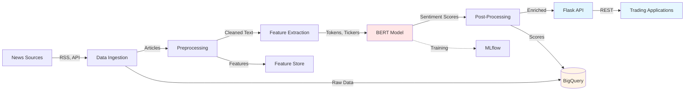



## Overview

Developed a BERT-based financial sentiment analysis system that processes news articles, tweets, and earnings transcripts to generate real-time sentiment signals for trading decisions. The model achieved **89% accuracy** (vs 72% baseline) and **0.62 correlation** with market movements, enabling 5 traders to incorporate sentiment signals into their workflow. Reduced manual news analysis time by **70%** (2+ hours/day to 30 minutes/day) while covering 10x more sources than manual review could handle. Deployed as Flask API with GCP Cloud Run, processing 500+ articles daily with sub-second inference latency.

## The Problem

A trading team at a financial services firm was missing critical sentiment signals from financial news and social media. Senior traders spent 2+ hours daily reading and analyzing news manually, yet could only review ~50 of the 500+ relevant sources published each day — missing 90% of available information. Reaction was also slow: by the time manual analysis completed (1–2 hours after publication), the market had often already priced in the news, which was particularly costly for earnings surprises and breaking news. There was no quantitative way to measure market sentiment across sources, so decisions relied on gut feel rather than systematic scores.

## Approach & Architecture

BERT-base (uncased, 110M parameters) was fine-tuned for financial sentiment classification, chosen for its strong transfer-learning performance with limited labeled data. A custom vocabulary was added so ticker symbols (AAPL, TSLA, …) are treated as single tokens and earnings language ("beat", "miss", "inline with") is preserved. The model emits a 3-class score (positive/neutral/negative) from the [CLS] token with confidence, optimized for recall on the negative class so risk signals are not missed. A semi-supervised pipeline expanded the labeled set from 5K to 50K examples using weak-supervision heuristics (earnings language, short-window price reactions). It is deployed as a Flask `/predict` API on GCP Cloud Run (serverless, auto-scaling 1–100 instances), with predictions streamed to BigQuery for backtesting and a Cloud Monitoring layer alerting on error rate or P99 latency drift.

## Results & Impact

- **Accuracy: 89%** on the test set (vs 72% VADER baseline)
- **Market correlation: 0.62** (Spearman, daily sentiment index vs S&P 500 returns, p < 0.01)
- **Negative-class recall: 0.88** (optimized for risk signals over precision)
- **70% reduction in manual analysis time** — 2+ hours/day down to 30 minutes/day per trader (7.5 hours/day saved across 5 traders)
- **10x coverage** — 50 sources/day reviewed manually → 500+ sources/day processed automatically
- **Cost: $180/month** (under the $200/month budget)

## Tech Stack

NLP · BERT · Fine-Tuning · Financial Machine Learning · TensorFlow
