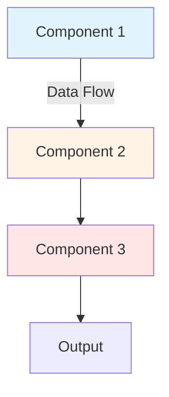

## Executive Summary

[150 words maximum] Summarize the problem, solution, and impact in one glance. This is the TL;DR for busy readers. Include:

- **Problem**: What business challenge were you solving? (1-2 sentences)
- **Solution**: What did you build/approach? (1 sentence)
- **Impact**: Quantified results (use XYZ formula) (1-2 sentences)

Example format:
"Built [solution] that [achieved outcome] by [approach]. Reduced [metric] by [X%] (from [baseline] to [final]), saving [$Y/year] in [cost area]. Model accuracy improved from [baseline] to [final], enabling [business impact]."

Write in past tense, be specific with numbers, and focus on business outcomes (not just technical metrics).

## Business Challenge

### Stakeholder Pain Points

[Describe 2-3 specific pain points that motivated this project]

Use this structure for each pain point:
1. **Quantify the problem**: Include numbers (time lost, cost, % impact)
2. **Who is affected**: Which team/stakeholders?
3. **Why it matters**: Business impact (revenue, cost, risk, opportunity)

Example:
"The marketing team operated with **6-hour data latency** in business metrics, preventing real-time campaign optimization. This caused **15-20% wasted ad spend** on underperforming campaigns that couldn't be paused until next day. Competitors with real-time analytics had significant advantage in fast-paced market."

### Success Metrics

[List 4-6 measurable business outcomes you aimed to achieve]

Format: Metric + target + why it matters

Example:
- **Reduce data latency**: From 6 hours to under 1 minute (enable real-time decisions)
- **Cost efficiency**: Reduce manual ETL costs from $50K/year to under $15K/year (80% savings)
- **Reliability**: Achieve 99.9% uptime for data pipeline during business hours
- **Scalability**: Handle 10M+ events per day with auto-scaling

### Constraints

[List 3-5 constraints that shaped your solution]

Categories to consider:
- **Budget**: Cost limitations (e.g., "$500/month infrastructure")
- **Timeline**: Deadlines (e.g., "6-week implementation before Q4 campaigns")
- **Data quality**: Data limitations (e.g., "No labeled data available")
- **Team expertise**: Resource constraints (e.g., "Small team, limited DevOps experience")
- **Regulatory**: Compliance requirements (e.g., "GDPR, model explainability")

## Technical Approach

### Architecture Overview

[Provide Mermaid diagram showing system architecture]

**Diagram tips**:
- Use `graph TD` (top-down) for data flow pipelines
- Use `graph LR` (left-right) for system architecture
- Color-code by component type (ingest, process, store, serve)
- Label all components with technology names (e.g., "AWS Lambda", "PostgreSQL")

### Technology Choices

[Explain 2-3 key technology decisions]

For each technology:
- **Decision**: What you chose
- **Rationale**: Why this choice (cost, performance, team expertise)
- **Alternatives considered**: What you evaluated and why you rejected them

Example:
"**AWS Lambda for Processing**
Chosen for serverless, pay-per-use model ($0.20 per 1M requests) and auto-scaling. Python 3.9 runtime with boto3 for AWS integration. Alternative: AWS Fargate (rejected due to higher cost for variable workload)."

### Data Pipeline / Model Architecture

[For ML projects: Describe model architecture, training pipeline, features]

**Model**: [Algorithm choice + why]
- Base model: [e.g., BERT-base, XGBoost]
- Hyperparameters: [Key settings with rationale]
- Input features: [Feature categories]

**Training**:
- Data sources: [Where data came from, how much]
- Evaluation metrics: [Which metrics and why]
- Performance: [Test set results with baseline comparison]

[For data engineering projects: Describe data flow, transformations, storage]

**Pipeline stages**:
1. **Ingestion**: [Data sources, format, rate]
2. **Processing**: [Transformations, validation, enrichment]
3. **Storage**: [Where data stored, partitioning strategy]
4. **Serving**: [How data accessed, latency]

## Implementation Journey

### Timeline Overview

**Week X-Y**: [Phase 1 summary]
**Week Z-W**: [Phase 2 summary]
**Week V-**: [Phase 3 summary]

Total duration: **[X] weeks/months** ([Month Year] - [Month Year])

### Phase 1: [Phase Name] (Weeks X-Y)

**Challenge 1: [Challenge Title]**
[Describe challenge in 2-3 sentences]

**Solution**:
[What you did to solve it]

**Result**:
[Quantified outcome]

**Challenge 2: [Challenge Title]**
[Describe challenge in 2-3 sentences]

**Solution**:
[What you did to solve it]

**Result**:
[Quantified outcome]

[Repeat for 2-3 challenges per phase]

**Tips**:
- Focus on non-obvious challenges (not "we didn't know how to use X")
- Show technical depth (specific solutions, not vague "we worked hard")
- Quantify results when possible (e.g., "reduced latency from 2hrs to 5min")

### Phase 2-4: [Repeat Structure]

[Same as Phase 1 for each major phase]

### Phase N: [Final Phase - Rollout/Adoption]

**Challenge N: Low Adoption / Integration Issues**
[Describe user adoption challenges]

**Solution**:
[How you addressed user needs, training, workflow integration]

**Result**:
[Adoption metrics, user satisfaction, behavioral change]

## Results & Impact

### Business Metrics

[Quantified impact using XYZ formula: "Accomplished [X] as measured by [Y], by doing [Z]"]

**Metric 1: [Category]**
- **Before**: [Baseline state with numbers]
- **After**: [Final state with numbers]
- **Impact**: [Business outcome]

**Metric 2: [Category]**
- **Before**: [Baseline state with numbers]
- **After**: [Final state with numbers]
- **Impact**: [Business outcome]

[Include 3-5 metrics covering: time saved, cost reduced, revenue increased, quality improved]

**Example**:
"**Reduced Data Latency by 98%**
- Before: Business metrics available 6 hours after day-end
- After: Real-time metrics within 45 seconds
- Impact: Marketing team can pause underperforming campaigns mid-day, saving 15-20% ad spend"

### Technical Metrics

[Model performance, system performance, scalability metrics]

**Performance**:
- [Metric]: [Value] (vs baseline: [Value])
- [Metric]: [Value] (vs baseline: [Value])

**Scalability**:
- Throughput: [X requests/day, events/month]
- Latency: [P50, P95, P99]

**Reliability**:
- Uptime: [% over X months]
- SLA achieved: [Yes/No, details]

### User Feedback

> "[Quote from user/stakeholder about impact]"
> — [Name, Title]

> "[Quote from user/stakeholder about impact]"
> — [Name, Title]

[Tips: Get specific quotes, not generic praise. Highlight unexpected benefits or behavior changes.]

## Lessons Learned

### What Worked Well

**1. [Approach/Technique]**
[What you did and why it worked]

**Applicability**: [When to use this approach, when it doesn't apply]

**2. [Approach/Technique]**
[What you did and why it worked]

**Applicability**: [When to use this approach, when it doesn't apply]

[Include 2-3 approaches that worked well]

### What to Do Differently

**1. [Mistake/Suboptimal Approach]**
[What didn't work and why]

**Next Time**: [What you'd do instead]

**2. [Mistake/Suboptimal Approach]**
[What didn't work and why]

**Next Time**: [What you'd do instead]

[Include 1-2 things to improve. Be honest but professional - focus on learning, not blame.]

**Tips**:
- Show growth mindset ("What I learned" not "What went wrong")
- Be specific (not vague "better planning")
- Focus on transferable insights (not one-off issues)

## Future Roadmap

### Planned Improvements

**[Quarter/Year]: [Feature Name]**
- [Description: What you plan to build]
- Expected impact: [Quantified benefit]
- Estimated effort: [Weeks/months]

[Include 2-3 near-term improvements]

### Scaling Opportunities

**[Opportunity 1]**
- [Description: How to scale this work]
- Expected impact: [Quantified benefit]
- Estimated effort: [Weeks/months]

**[Opportunity 2]**
- [Description: How to scale this work]
- Expected impact: [Quantified benefit]
- Estimated effort: [Weeks/months]

[Include 2-3 longer-term opportunities. Think: "What's the 10x version of this project?"]

---

*Last Updated: [Month Year]*
