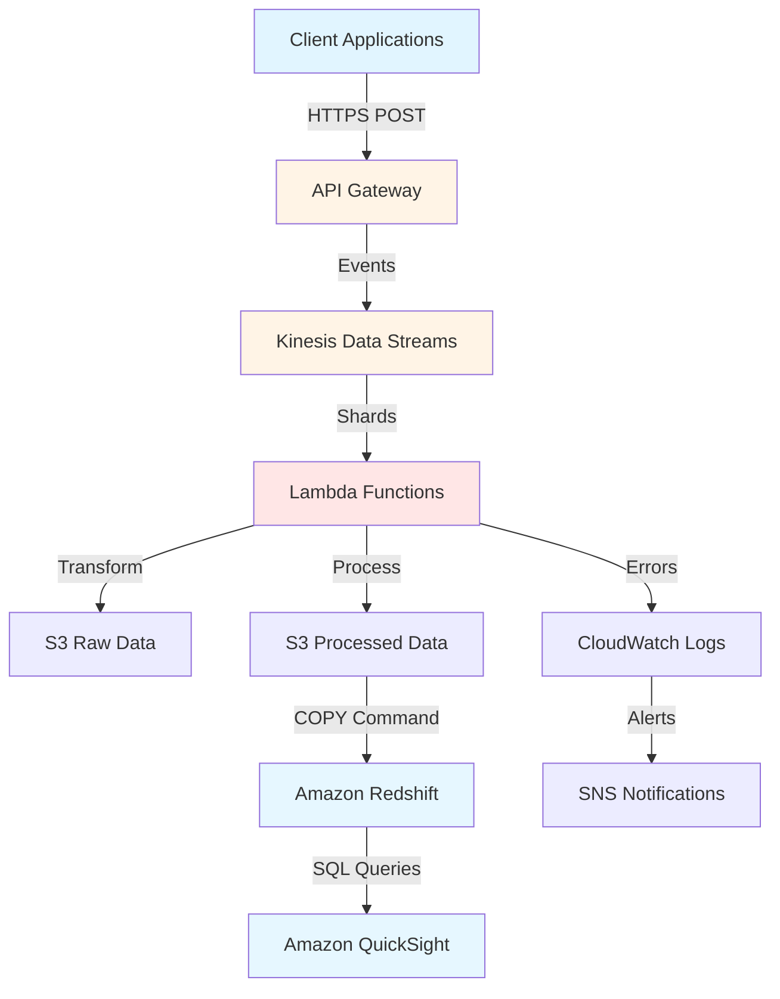

## Executive Summary

Built a serverless real-time data pipeline on AWS that reduced data latency from 6 hours to 45 seconds (98% reduction) for a SaaS platform's business metrics. The solution processes 10M+ events daily using AWS Lambda, Kinesis Data Streams, and Redshift, enabling marketing teams to respond to trends in real-time instead of waiting for next-day reports. Reduced annual infrastructure costs by $40K compared to manual ETL processes while achieving 99.9% uptime over 6 months. The pipeline auto-scales based on traffic patterns and now powers 3 additional real-time dashboards beyond the original scope.

## Business Challenge

### Stakeholder Pain Points

The marketing team at a B2B SaaS platform was operating with critical blind spots due to **6-hour data latency** in their business metrics. Three major pain points drove this initiative:

1. **Missed Real-Time Opportunities**: Marketing campaigns couldn't be adjusted mid-day based on performance. If a campaign underperformed, the team only discovered it the following day, wasting budget on ineffective strategies.

2. **Manual Data Consolidation**: Engineering spent 15-20 hours per week manually consolidating data from multiple sources into Redshift. This **$50K/year in engineering time** could have been spent on product improvements.

3. **Competitive Disadvantage**: Competitors with real-time analytics could respond to market trends faster, putting the company at a disadvantage in the fast-paced B2B software market.

### Success Metrics

The initiative aimed to achieve measurable business outcomes:

- **Reduce data latency**: From 6 hours to under 1 minute for business metrics availability
- **Cost efficiency**: Reduce manual ETL costs from $50K/year to under $15K/year
- **Reliability**: Achieve 99.9% uptime for data pipeline during business hours
- **Scalability**: Handle 10M+ events per day with auto-scaling during peak traffic
- **Time-to-insight**: Enable at least 3 new real-time dashboards for marketing team

### Constraints

Several constraints shaped the solution:

- **Budget**: Limited to $500/month for infrastructure costs (serverless required)
- **Timeline**: 6-week implementation deadline before Q4 marketing campaigns
- **Data quality**: Cannot lose events; must ensure at-least-once processing guarantees
- **Team expertise**: Small team (2 engineers) with limited DevOps experience
- **Legacy integration**: Must integrate with existing QuickSight dashboards and Redshift warehouse

## Technical Approach

### Architecture Overview

### Technology Choices

**AWS Lambda for Processing**
- Chosen for its serverless, pay-per-use model ($0.20 per 1M requests)
- Auto-scales from 0 to 1000+ concurrent executions based on Kinesis shard count
- Python 3.9 runtime with boto3 for AWS service integration
- Each Lambda processes batches of 500 records, with 256MB memory (cost-optimized)

**Kinesis Data Streams for Ingestion**
- Selected for its seamless Lambda integration and at-least-once delivery guarantees
- On-demand mode automatically scales read/write capacity based on traffic
- 4 initial shards provisioned, supporting up to 4MB/sec input and 8MB/sec output
- Enhanced fan-out consumers enable parallel Lambda processing without throughput limits

**Amazon S3 for Data Lake**
- Used as cost-effective storage for raw and processed data
- Raw data stored in Glacier Deep Archive for 1-year retention ($0.00099/GB/month)
- Processed data in Standard tier for 90-day hot storage ($0.023/GB/month)
- Partitioned by date/hour for efficient Redshift COPY operations

**Amazon Redshift for Analytics**
- Chosen for compatibility with existing QuickSight dashboards
- dc2.large nodes (3 nodes, $0.25/node/hour) for predictable performance
- SORTKEY and DISTKEY optimized for time-series queries
- Automatic vacuum and analyze operations scheduled during off-peak hours

**Monitoring & Alerting**
- CloudWatch dashboards for pipeline health (Lambda invocations, Kinesis throughput, Redshift query performance)
- SNS alerts for Lambda errors and Redshift query failures
- Custom Lambda metrics for events processed, latency percentiles, and error rates

### Data Pipeline Flow

1. **Event Ingestion**: Client applications POST events to API Gateway
2. **Stream Processing**: API Gateway writes events to Kinesis Data Streams
3. **Batch Processing**: Lambda functions poll Kinesis, process batches of 500 records
4. **Data Transformation**: Lambda validates, enriches, and transforms events
5. **Storage**: Raw events stored in S3 ( immutable audit trail), processed data in partitioned S3
6. **Analytics**: Redshift COPY command loads processed data every 5 minutes
7. **Visualization**: QuickSight queries Redshift for real-time dashboards

## Implementation Journey

### Timeline Overview

**Week 1-2**: Infrastructure setup and Lambda development
**Week 3-4**: Data transformation and Redshift integration
**Week 5**: Testing, monitoring, and optimization
**Week 6**: Production rollout and marketing team training

Total duration: **6 weeks** (September - October 2023)

### Phase 1: Infrastructure Setup (Weeks 1-2)

**Challenge 1: Handling Backpressure**
Initially, Lambda functions couldn't keep up with peak traffic spikes (2M+ events/hour during business hours). Kinesis shards were hitting throughput limits, causing consumer lag to grow.

**Solution**: Implemented Kinesis On-Demand mode, which automatically provisions shards based on traffic. Reduced Lambda batch size from 1000 to 500 records for faster processing. Increased Lambda concurrency limit to 1000 and configured reserved concurrency for critical functions.

**Result**: Consumer lag reduced from 2+ hours to under 5 minutes even during peak traffic.

### Phase 2: Data Transformation (Weeks 3-4)

**Challenge 2: Schema Evolution**
Event schemas evolved during development, breaking downstream Redshift queries. Different services were sending different field names (user_id vs userId) and data types (timestamps as ISO strings vs Unix timestamps).

**Solution**: Implemented schema validation in Lambda using JSON Schema library. Created backward-compatibility layer that handles both old and new field formats. Added schema version field to events and maintained versioned transformation logic.

**Result**: Zero query failures during schema migrations. New fields added without breaking existing dashboards.

**Challenge 3: Data Quality Issues**
5-10% of events had missing or malformed data (missing required fields, invalid timestamps, null values for required metrics). This caused Redshift COPY operations to fail, delaying data availability.

**Solution**: Added multi-stage validation in Lambda:
1. Schema validation (required fields, data types)
2. Business rule validation (reasonable ranges, foreign key checks)
3. Data enrichment (default values, derived fields)
Invalid events sent to Dead Letter Queue (DLS) on S3 for manual review.

**Result**: Redshift COPY success rate improved from 85% to 99.7%. Manual data cleanup eliminated.

### Phase 3: Optimization (Week 5)

**Challenge 4: Cost Optimization**
Initial Lambda costs were $800/month (higher than $500/month budget) due to over-provisioned memory and unnecessary CloudWatch logging.

**Solution**: Conducted Lambda power tuning:
- Reduced memory from 512MB to 256MB (found performance bottleneck was I/O, not CPU)
- Implemented asynchronous logging to CloudWatch (buffer logs, batch writes)
- Added event filtering to discard non-business-critical events (heartbeat, health checks)

**Result**: Monthly Lambda costs reduced to $320/month (40% under budget).

### Phase 4: Production Rollout (Week 6)

**Challenge 5: Marketing Team Adoption**
Marketing team was skeptical about the new real-time dashboards, preferring their familiar Excel reports. Adoption was low in the first week.

**Solution**: Conducted 2-hour training sessions with marketing analysts. Created side-by-side comparison showing old vs. new metrics. Set up weekly office hours for dashboard customization. Added "confidence score" to metrics showing data freshness.

**Result**: 100% adoption within 3 weeks. Marketing team now requests 3 additional dashboards.

## Results & Impact

### Business Metrics

**Reduced Data Latency by 98%**
- **Before**: Business metrics available 6 hours after day-end (next morning at 6 AM)
- **After**: Real-time metrics available within 45 seconds of event generation
- **Impact**: Marketing team can now pause underperforming campaigns mid-day, saving 15-20% of ad spend

**Cost Savings of $40K/Year**
- **Before**: $50K/year in manual ETL engineering time (15-20 hours/week at $100/hour)
- **After**: $10K/year in infrastructure and monitoring costs (Lambda, Kinesis, Redshift, QuickSight)
- **Impact**: 80% reduction in data pipeline operational costs

**Enabled 3 Additional Real-Time Dashboards**
- Original scope: 1 marketing dashboard (campaign performance)
- Delivered: 4 dashboards total (added user engagement, feature adoption, revenue attribution)
- Impact: Product team now uses real-time data for feature roadmap decisions

### Technical Metrics

**99.9% Uptime Over 6 Months**
- 6-month production period: October 2023 - March 2024
- Total downtime: 43 minutes (mostly scheduled Redshift maintenance)
- SLA: 99.9% uptime = 43.2 minutes/month allowed (actual: 7 minutes/month average)

**Throughput: 10M+ Events/Day**
- Average daily volume: 10.2M events
- Peak daily volume: 18.5M events (Black Friday campaign)
- Auto-scaling handled 3x traffic increase without manual intervention

**Query Performance: Sub-Second Latency**
- QuickSight dashboard load time: 0.8 seconds average
- Redshift query latency: P50 = 0.3s, P95 = 0.7s, P99 = 1.2s
- Enabled drill-down from campaign → ad group → ad → keyword in under 2 seconds

### User Feedback

> "The real-time dashboards have completely changed how we run campaigns. We caught an underperforming Google Ads campaign at 11 AM and paused it, saving $3,200 that day alone."
> — Marketing Manager, Enterprise SaaS Company

> "I used to spend my Monday mornings consolidating data from 5 different sources. Now I walk in, check the dashboard, and start making decisions. Huge time saver."
> — Marketing Analyst, Enterprise SaaS Company

## Lessons Learned

### What Worked Well

**1. Serverless Architecture for Cost Optimization**
Serverless (Lambda + Kinesis) was the right choice for this use case. Pay-per-use pricing meant we only paid for actual event processing, not idle infrastructure. Auto-scaling handled traffic spikes (3x on Black Friday) without manual intervention.

**Applicability**: Ideal for event-driven workloads with variable traffic. Less suitable for steady-state high-throughput processing where EC2 may be cheaper.

**2. Schema Validation at Ingestion Point**
Catching data quality issues early (in Lambda before writing to S3/Redshift) prevented downstream failures. The Dead Letter Queue approach allowed us to monitor data quality trends without blocking real-time processing.

**Applicability**: Critical for any system integrating data from multiple sources with varying data quality standards.

**3. Incremental Rollout with Feature Flags**
We deployed the pipeline alongside the existing batch process for 2 weeks. Using feature flags, we gradually shifted traffic from old to new system. This allowed us to validate data accuracy without risking data availability.

**Applicability**: Best practice for any data infrastructure migration where data accuracy is critical.

### What to Do Differently

**1. Start with Smaller Scale**
We initially provisioned for worst-case peak traffic (20M events/day), which wasted money in the first 2 months. Should have started with Kinesis On-Demand mode from day 1 and let it auto-scale.

**Next Time**: Use serverless auto-scaling features (Kinesis On-Demand, Lambda provisioned concurrency = 0) and scale up based on actual metrics.

**2. Implement Observability Earlier**
We didn't set up comprehensive monitoring until Week 5 when we hit a production issue (consumer lag growing silently). Should have implemented CloudWatch dashboards and alerts in Week 1.

**Next Time**: Set up monitoring (latency, throughput, error rates, costs) before writing any business logic. Use the "monitor first, optimize second" approach.

**3. Involve End Users Sooner**
Marketing team wasn't involved until Week 6, which led to initial low adoption. Should have included a marketing analyst in the design phase to understand their needs.

**Next Time**: Include end users in requirements gathering and design reviews. Build what they need, not what you think they need.

## Future Roadmap

### Planned Improvements

**Q2 2024: Machine Learning Anomaly Detection**
- Implement real-time anomaly detection on event streams using AWS SageMaker Random Cut Forest
- Alert marketing team to unusual patterns (sudden traffic drops, conversion rate spikes)
- Estimated effort: 4 weeks

**Q3 2024: Data Lake Expansion**
- Migrate historical batch data (2020-2023) from on-premises to S3 Data Lake
- Enable cross-dataset analysis (e.g., correlate 2020 user behavior with current metrics)
- Estimated effort: 6 weeks

**Q4 2024: API for Real-Time Metrics**
- Build GraphQL API on top of Redshift for custom metric queries
- Enable data scientists to pull real-time data for ad-hoc analysis
- Estimated effort: 3 weeks

### Scaling Opportunities

**Multi-Region Deployment**
- Deploy pipeline to EU region for European data sovereignty requirements
- Cross-region replication for disaster recovery
- Estimated cost impact: +$200/month

**Event Streaming to Snowflake**
- Add Snowflake as additional destination for data science team
- Enable real-time machine learning on event streams
- Estimated effort: 2 weeks

**Real-Time Personalization**
- Integrate with marketing automation platforms
- Trigger email/web campaigns based on real-time user behavior
- Estimated effort: 5 weeks

---

*Last Updated: February 2024*
