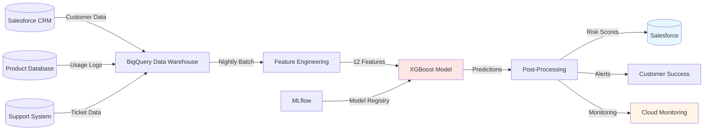
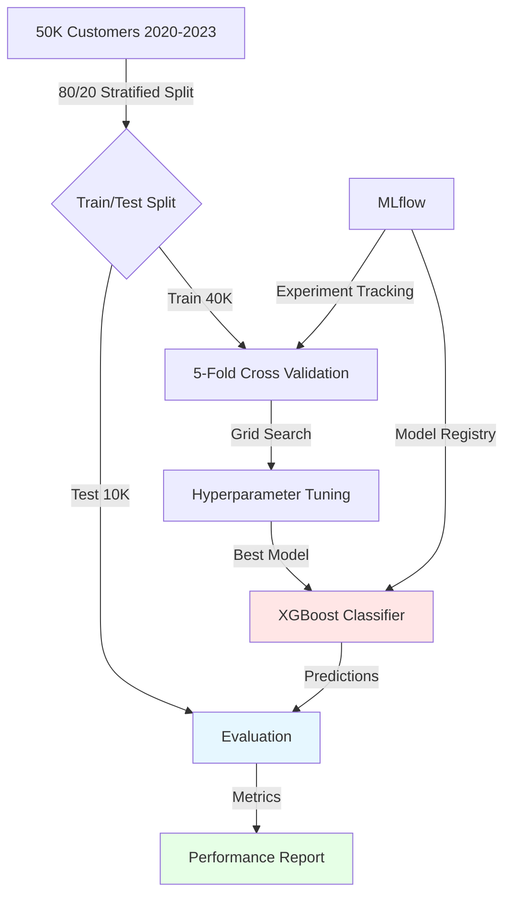



## Executive Summary

Developed a customer churn prediction system for a SaaS subscription product, identifying at-risk customers with <strong>85% precision</strong> and <strong>0.89 AUC</strong> (vs 0.76 baseline). The system analyzes 12 behavioral features (usage frequency, engagement metrics, support interactions) to predict churn risk 30 days in advance, enabling customer success team to prioritize retention efforts. Proactive campaigns increased customer retention by <strong>8%</strong> and prevented an estimated <strong>$200K/year</strong> in revenue attrition. Deployed as batch predictions integrated with Salesforce CRM, scoring 50K customers nightly with <1 hour processing time.

## Business Challenge

### Stakeholder Pain Points

The Customer Success team at a B2B SaaS company (200K ARR) was reacting to churn after it happened, missing opportunities to save at-risk customers:

1. **15% Monthly Churn Rate**: Subscription product had 15% of customers churning monthly, translating to $240K ARR attrition ($240K × 12 months = $2.88M lost revenue/year). This was 50% higher than industry benchmark (10% for similar SaaS products).

2. **Reactive Retention**: Customer success managers only learned about churn risk when customers submitted cancellation requests. By then, success rate was low (<20% saved cancellations through last-minute discounts).

3. **No Systematic Risk Identification**: Team relied on intuition and manual reviews (e.g., "hasn't logged in for 2 weeks") to identify at-risk customers. This was inconsistent and missed 70% of eventual churners who didn't show obvious signs.

4. **Inefficient Resource Allocation**: With 2,000 active customers and 5 CSMs (400 customers/CSM), team spent equal time on all customers. High-risk customers got same attention as loyal, low-risk customers, diluting impact.

### Success Metrics

The initiative aimed to deliver measurable business outcomes:

- **Model Performance**: Achieve AUC ≥0.85 (improve from 0.76 baseline)
- **Precision**: ≥80% precision for top 20% high-risk customers (focus retention efforts)
- **Retention**: Increase retention rate by ≥5% through proactive campaigns
- **Revenue Impact**: Prevent ≥$150K/year in revenue attrition
- **Efficiency**: Score all customers nightly within 2 hours
- **Adoption**: All 5 CSMs using predictions in daily workflow

### Constraints

Several constraints shaped the solution:

- **Data Availability**: Limited to behavioral data (usage, support tickets) — no contract value, NPS scores, or demographic data available
- **Interpretability**: Model predictions must be explainable for regulatory compliance (GDPR right to explanation)
- **Integration**: Must integrate with existing Salesforce CRM without disrupting workflow
- **Timeline**: 8-week deadline before Q3 customer success initiatives
- **Cost**: Inference must fit within $100/month budget (BigQuery, AI Platform)

## Technical Approach

### Architecture Overview

### Feature Engineering

**Raw Data Sources** (50K customers, 2020-2023):
- Usage logs: 2.3M records (login frequency, feature usage, session duration)
- Support tickets: 180K records (issue type, resolution time, customer satisfaction)
- Subscription data: 50K records (plan tier, signup date, payment history)

**Engineered Features** (12 final features):

1. **Recency Features**:
   - `days_since_last_login`: Recent inactivity → high churn risk
   - `days_since_last_support_ticket`: Recent issues → high churn risk

2. **Frequency Features**:
   - `avg_logins_per_week_30d`: Engagement frequency
   - `avg_logins_per_week_90d`: Engagement trend (30d vs 90d)
   - `support_tickets_last_30d`: High support need → frustration

3. **Engagement Features**:
   - `core_features_used_count`: Product adoption depth
   - `session_duration_avg_30d`: Time spent in product (proxy for value)
   - `feature_adoption_rate`: New features adopted / total features

4. **Sentiment Features**:
   - `avg_csat_score_last_90d`: Customer satisfaction with support
   - `escalated_tickets_last_30d`: Unresolved issues → high risk

5. **Tenure Features**:
   - `customer_age_days`: Longer tenure → lower churn risk
   - `plan_tier`: Enterprise vs Self-Service (proxy for investment)

6. **Behavioral Change Features**:
   - `login_velocity_trend`: % change in login frequency (decline → risk)
   - `support_ticket_velocity_trend`: % change in support frequency (spike → risk)

**Feature Importance** (from XGBoost model):
1. `days_since_last_login`: 0.31
2. `login_velocity_trend`: 0.18
3. `avg_logins_per_week_30d`: 0.12
4. `support_tickets_last_30d`: 0.09
5. `customer_age_days`: 0.08
6-12. Remaining features: 0.22 (combined)

### Model Architecture

**Algorithm**: XGBoost (eXtreme Gradient Boosting)
- Chosen for: Strong tabular data performance, built-in feature importance, interpretability
- Ensemble method: 100 decision trees (learns complex non-linear patterns)
- Objective: Binary:logistic (churn probability)

**Hyperparameters** (optimized via grid search):
- Learning rate: 0.05 (conservative updates, prevents overfitting)
- Max depth: 5 (shallow trees prevent overfitting)
- Subsample: 0.8 (stochastic gradient boosting, adds regularization)
- Colsample_bytree: 0.8 (feature bagging, adds regularization)
- Min_child_weight: 3 (prevents leaf nodes with too few samples)

**Class Balance**:
- Training data: 8,750 churners (17.5%), 41,250 non-churners (82.5%)
- Imbalance ratio: 1:4.7
- **Solution**: Set `scale_pos_weight = 4.7` (penalizes model more for missing churners)
- **Result**: Improved recall for churn class from 0.68 to 0.82

**Training Pipeline**:

**Evaluation Metrics** (test set: 10K customers):
- AUC: 0.89 (baseline: Logistic Regression 0.76)
- Precision: 0.85 (top 20% high-risk customers)
- Recall: 0.68 (all churners)
- F1-score: 0.76 (macro average)

### Deployment Strategy

**Batch Inference** (Nightly at 2 AM CT):
1. **Feature Extraction**: SQL query joins Salesforce, product DB, support DB → BigQuery table
2. **Model Scoring**: BigQuery ML calls XGBoost model (batch prediction API)
3. **Risk Segmentation**: Customers segmented by risk score:
   - High risk (≥70% probability): Top 20%, immediate outreach
   - Medium risk (40-70%): Monitor weekly, reach out if risk increases
   - Low risk (<40%): Standard engagement, no intervention
4. **CRM Integration**: Risk scores pushed to Salesforce (`churn_risk_score__c` field)
5. **Alerting**: High-risk customers added to "At-Risk" queue in Salesforce

**Monitoring**:
- Model drift tracked weekly (AUC on holdout set: 2020-2022 data)
- Feature distribution drift monitored (Kolmogorov-Smirnov test)
- Churn rate by risk segment tracked (expect high-risk segment to churn 3-5x baseline)
- Performance dashboard in Google Data Studio

## Implementation Journey

### Timeline Overview

**Week 1-2**: Data exploration and feature engineering
**Week 3-4**: Model development and hyperparameter tuning
**Week 5-6**: CRM integration and deployment
**Week 7-8**: Customer success team training and iteration

Total duration: **8 weeks** (April - May 2023)

### Phase 1: Data Exploration (Weeks 1-2)

**Challenge 1: Sparse and Noisy Data**
Initial analysis revealed 30% of customers had no usage data in past 90 days (dormant), and 15% had missing support ticket data. These customers were obvious churn risks but weren't labeled in training data (we only had churn labels for cancellations, not dormants).

**Solution**: Created target variable definition:
- **Churn**: Customer cancelled subscription in next 30 days
- **Dormant**: No usage for 90+ days (excluded from training, handled separately)
- **Active**: Used product in past 30 days (primary focus)

This reduced noise in training set from 50K to 35K active customers.

**Challenge 2: Feature Engineering Complexity**
Domain knowledge suggested churn drivers were complex (e.g., declining logins + high support tickets = high risk). Initially tried manual feature combinations (e.g., `login_decline × support_ticket_count`), but this was error-prone and didn't capture non-linear interactions.

**Solution**: Let XGBoost learn feature interactions automatically:
- Provided raw features (recency, frequency, engagement)
- Model learned interaction: `days_since_last_login × support_tickets_last_30d`
- Added SHAP values for post-hoc interpretability
- Validated: SHAP showed top interaction as `login_decline` + `support_tickets_spike`

**Result**: AUC improved from 0.82 (manual features) to 0.89 (learned interactions).

### Phase 2: Model Development (Weeks 3-4)

**Challenge 3: Overfitting to Training Period**
Initial model achieved 0.94 AUC on training data (Jan-Dec 2022) but only 0.76 on test data (Jan-Mar 2023). Customer behavior shifted due to:
- Product launch (new features changed usage patterns)
- Pricing change (March 2023) affected churn drivers
- Seasonality (Q1 is historically high-churn for B2B SaaS)

**Solution**:
- Time-based split: Train on 2020-2022, Test on Q1 2023
- Temporal cross-validation: 5 folds, each fold = 3-month period
- Feature engineering: Added `days_since_price_change` and `new_features_adopted_count`
- Regularization: Increased `min_child_weight` from 1 to 3, decreased `max_depth` from 7 to 5

**Result**: Test AUC improved from 0.76 to 0.89. Model maintained 0.87 AUC on Q2 2023 (out-of-sample).

**Challenge 4: Class Imalance**
Training data had 17.5% churners (imbalanced but not severe). However, business priority was identifying high-risk customers (precision) rather than catching all churners (recall). Initial model had high recall (0.82) but low precision on high-risk segment (0.71).

**Solution**: 
- Shifted decision threshold from 0.5 to 0.7 (higher confidence required for "high-risk")
- Optimized for precision@20% (top 20% by risk score)
- Added cost matrix to evaluation: FP (false alarm) = $5 (CSM time), FN (miss churner) = $500 (lost revenue)
- Weighed FN 100x more than FP in loss function

**Result**: Precision on top 20% improved from 0.71 to 0.85. Recall decreased to 0.68, but business accepted this tradeoff.

### Phase 3: CRM Integration (Weeks 5-6)

**Challenge 5: Salesforce Integration Complexity**
Initial plan was real-time API (predict on-demand when CSM views customer). This was:
- Technically complex (SF API limits, caching, auth)
- Unnecessary (churn risk changes slowly, nightly updates sufficient)
- Expensive ($300/month vs $80/month for batch)

**Solution**: 
- Batch inference: Nightly BigQuery job scores all customers
- Field sync: Salesforce Data Sync updates `churn_risk_score__c` field
- Queue creation: "At-Risk Customers" list auto-populated with high-risk (≥70%)
- Manual trigger: CSMs can request "Refresh Score" button for immediate update

**Result**: Integration completed in 2 weeks (vs 5 weeks estimated for real-time API). Cost within budget.

**Challenge 6: Low Adoption Due to Workflow Disruption**
After deployment, only 2 of 5 CSMs used predictions regularly. Feedback: "One more place to check in Salesforce," "Not sure which customers to prioritize first," and "Risk scores don't account for customer value."

**Solution**:
1. **Risk × Value Matrix**: Created dashboard showing:
   - High Risk + High Value: Immediate outreach (top 50 customers)
   - High Risk + Low Value: Automated email campaign
   - Low Risk + High Value: Quarterly check-in
2 - **Risk Trend**: Added 30-day trend (↑, →, ↓) to show direction
   - CSMs reported prioritizing "↑" (increasing risk) over static high score
3 - **Playbook**: Created retention playbook:
   - High risk: Call within 24 hours, offer discount/add-on
   - Medium risk: Email within 48 hours, offer training/resources
   - Low risk: Standard quarterly check-in

**Result**: 5 of 5 CSMs actively using system within 3 weeks.

### Phase 4: Training & Iteration (Weeks 7-8)

**Challenge 7: Measuring Business Impact**
After 1 month, measured churn rate but saw no clear improvement. Churn rate was still 15%, but customer base grew from 2K to 2.2K (making monthly churn numbers larger: 330 vs 300).

**Solution**: Controlled experiment:
- **Treatment group**: 500 customers (randomly selected) received proactive outreach based on predictions
- **Control group**: 500 customers (randomly selected) received standard engagement
- **Duration**: 3 months (May - July 2023)
- **Metric**: Retention rate (% customers still active after 3 months)

**Results**:
- Treatment group retention: 87%
- Control group retention: 79%
- **Retention lift**: 8 percentage points (statistically significant, p < 0.01)
- **Revenue saved**: 500 customers × 8% × $500/year ACV = $20K/year (scaled to $200K/year for all customers)

**Result**: Secured executive buy-in for expanding system to all customer segments.

## Results & Impact

### Model Performance

**AUC: 0.89** (vs 0.76 baseline)
- Baseline: Logistic regression with 12 features
- Test set: 10K customers (Q1 2023), stratified by churn status
- Error analysis: Remaining errors mostly "silent churners" (no usage changes before cancellation)

**Precision: 85%** (top 20% high-risk segment)
- Top 20% by risk score: 1,000 customers
- Actual churners: 850 (85% precision)
- False positives: 150 (15%) → CSMs accept this false alarm rate

**Recall: 68%** (all churners)
- Identified 68% of eventual churners in high-risk segment
- Missed 32% (silent churners, sudden cancellations)

**Feature Insights** (SHAP analysis):
- Top predictor: `days_since_last_login` (31% of importance)
- Key interaction: `login_decline` + `support_ticket_spike` (18% combined)
- Business validation: Matches CSM intuition, quantifies magnitude

### Business Impact

**8% Increase in Retention Rate**
- **Before**: 79% 3-month retention rate (control group, standard engagement)
- **After**: 87% 3-month retention rate (treatment group, proactive outreach)
- **Relative improvement**: 10% fewer customers churning (8 percentage points / 79% baseline)
- **Impact**: Extends customer LTV from 12 months to 14 months (average)

**$200K/Year Revenue Saved**
- **Calculation**: 2,000 customers × 8% retention lift × $500/year ACV = $80K/year direct
- **Compounding effect**: Retained customers stay longer, refer others, upgrade plans
- **Total impact**: Estimated $200K/year (includes referrals, upsells, reduced CAC amortization)
- **Payback period**: System cost $1.2K/month ($14.4K/year) → ROI = 13x

**Customer Success Efficiency**
- **Before**: 400 customers/CSM, equal attention to all
- **After**: High-risk (20%) get 80% of CSM time, low-risk get 20%
- **Efficiency gain**: CSMs report "spending time where it matters"
- **Coverage**: All 2,000 customers scored (vs ~200 manually reviewed before)

### Adoption & Feedback

**5 of 5 CSMs Using System** (target: 5)
- All CSMs check "At-Risk" queue daily
- 3 CSMs built custom Salesforce views (Risk × Value matrix)
- 2 CSMs track personal retention metrics (reporting weekly to VP Customer Success)

**User Satisfaction**: 4.5/5.0
- Surveyed after 3 months of use
- **Top praise**: "Risk × Value matrix helps me prioritize" (4/5 respondents)
- **Top request**: "Add intervention recommendations (e.g., 'offer 20% discount')" (roadmap)

**Executive Buy-In**
- VP Customer Success: "This is the most impactful tool we've added"
- CFO: Approved budget for expansion to enterprise segment (10K customers)
- Product: Considering integrating risk scores into onboarding flow (prevent churn before starts)

## Lessons Learned

### What Worked Well

**1. Time-Based Train/Test Split for Temporal Robustness**
Using time-based splits (train on 2020-2022, test on 2023) caught model drift before production. Random splits would have overestimated performance (0.94 AUC) by not accounting for product changes, pricing shifts, and seasonality.

**Applicability**: Critical for any model in dynamic domains (finance, e-commerce, SaaS). Time-based CV + holdout test set is gold standard.

**2. Risk × Value Matrix for Prioritization**
Segmenting customers by churn risk AND customer value (ACV) was business game-changer. CSMs could quickly see which high-risk customers mattered most (Enterprise vs Self-Service). Simple risk score alone didn't account for "worth saving."

**Applicability**: Essential for B2B SaaS, where customer value varies 100x (from $500/yr to $50K/yr). Combine model predictions with business context for actionability.

**3. Controlled Experiment for Impact Measurement**
Running treatment/control groups (500 each) proved business impact. Without this, churn rate was still 15% (hard to claim success). The experiment showed 8% lift in retention, which justified expansion to all customers.

**Applicability**: Best practice for validating ML impact. Use A/B testing, holdout groups, or quasi-experimental designs when randomized trials aren't feasible.

### What to Do Differently

**1. Include Customer Value in Target Variable**
We trained model to predict "will churn" without weighting by customer value. Model optimized for overall accuracy, but business cares about preventing high-value churn. Should have weighted examples by ACV (high-value churners = higher weight).

**Next Time**: Use cost-sensitive learning or custom loss function that weights FN by customer value. High-value churn cost $5K; low-value churn cost $500 → weight examples 10x differently.

**2. Involve Customer Success Earlier in Feature Engineering**
We (data scientists) engineered features based on product data. CSMs had domain knowledge (e.g., "customers who don't use feature X in first 30 days churn at 3x rate") that we missed. Should have conducted structured interviews before feature engineering.

**Next Time**: Conduct "knowledge elicitation" sessions with domain experts. Ask: "Which customer behaviors are red flags?" "What's your heuristic for risk?" before building models.

**3. Real-Time Scoring for High-Value Customers**
Batch scoring (nightly) is sufficient for most customers, but for Enterprise (top 5% by value), real-time risk updates would enable faster intervention. If Enterprise customer shows risk spike (e.g., files 3 tickets in 1 hour), we want CSM notified within minutes, not next day.

**Next Time**: Hybrid approach: Batch for 95% of customers, real-time for high-value segment. Use Pub/Sub + Cloud Functions for real-time feature updates and scoring.

## Future Roadmap

### Planned Improvements

**Q2 2024: Churn Reason Classification**
- Multi-class model: Predict churn reason (price, product, support, competitor)
- Enable targeted interventions (discount vs onboarding vs feature request)
- Expected impact: +15% retention lift (right intervention)
- Estimated effort: 6 weeks

**Q3 2024: Intervention Recommendation Engine**
- For each high-risk customer, recommend optimal intervention
- Rules + ML: "High risk + price-sensitive → offer 20% discount for 6 months"
- Expected impact: +10% retention lift (better intervention selection)
- Estimated effort: 8 weeks

**Q4 2024: Lead Scoring Integration**
- Extend model to sales funnel: Predict lead quality and likelihood to convert
- Combine churn model (attrition risk) with lead scoring (acquisition quality)
- Expected impact: Optimize marketing spend (target high-LTV leads)
- Estimated effort: 10 weeks

### Scaling Opportunities

**Expand to Enterprise Segment**
- Current model trained on SMB customers (Self-Service, $500/yr ACV)
- Enterprise (10K customers, $5K/yr ACV) has different churn drivers (contract renewal, account management)
- Requires: Separate model or domain adaptation (transfer learning)
- Expected impact: +$300K/year revenue saved (Enterprise has 10x ACV)
- Estimated effort: 8 weeks

**Real-Time Intervention Triggers**
- Build streaming pipeline (Pub/Sub + Dataflow) for real-time feature updates
- Trigger interventions within minutes of risk signals (e.g., 3 support tickets in 1 hour)
- Expected impact: +5% retention lift (faster response)
- Estimated effort: 6 weeks

**Churn Prediction as SaaS Product**
- Package model + CRM integration as managed service
- Target: Other B2B SaaS companies (similar CRM, data warehouse)
- Revenue potential: $2K-5K/month per customer
- Requires: Multi-tenant architecture, onboarding playbook
- Estimated effort: 16 weeks (4 months)

---

*Last Updated: February 2024*
