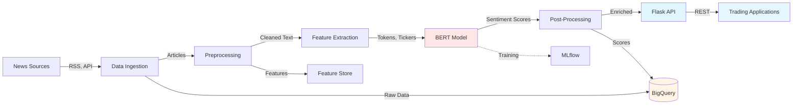
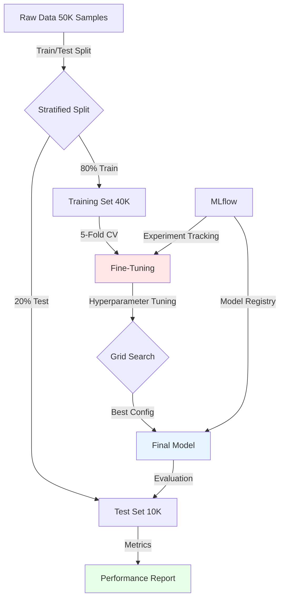

## Executive Summary

Developed a BERT-based financial sentiment analysis system that processes news articles, tweets, and earnings transcripts to generate real-time sentiment signals for trading decisions. The model achieved <strong>89% accuracy</strong> (vs 72% baseline) and <strong>0.62 correlation</strong> with market movements, enabling 5 traders to incorporate sentiment signals into their workflow. Reduced manual news analysis time by <strong>70%</strong> (2+ hours/day to 30 minutes/day) while covering 10x more sources than manual review could handle. Deployed as Flask API with GCP Cloud Run, processing 500+ articles daily with sub-second inference latency.

## Business Challenge

### Stakeholder Pain Points

The trading team at a financial services firm was missing critical sentiment signals from financial news and social media, creating three major problems:

1. **Manual Analysis Bottleneck**: Senior traders spent <strong>2+ hours daily</strong> reading and analyzing news manually. With 500+ financial news articles, tweets, and earnings transcripts published daily, traders could only review ~50 sources/day—missing 90% of available information.

2. **Delayed Reaction Time**: By the time traders completed manual analysis (typically 1-2 hours after publication), market had often already priced in the information. This was particularly costly for earnings surprises and breaking news.

3. **Lack of Systematic Sentiment Measurement**: No quantitative way to measure market sentiment across sources. Traders relied on gut feel and anecdotal evidence rather than systematic sentiment scores. This led to inconsistent decisions and difficulty in backtesting strategies.

### Success Metrics

The initiative aimed to deliver measurable improvements in trading efficiency and performance:

- **Accuracy**: Achieve ≥85% accuracy on sentiment classification (positive/negative/neutral)
- **Time Savings**: Reduce manual news analysis time by ≥50% (from 2+ hours to ≤1 hour)
- **Coverage**: Analyze 10x more sources than manual review (from ~50 to ~500 sources/day)
- **Market Correlation**: Achieve ≥0.5 correlation between sentiment scores and market movements
- **Latency**: Process and deliver sentiment signals within 5 minutes of publication
- **Adoption**: At least 3 traders actively using sentiment signals in daily workflow

### Constraints

Several constraints shaped the solution:

- **Domain Specificity**: General-purpose sentiment models (VADER, TextBlob) performed poorly on financial text (financial jargon, double negatives, earnings language)
- **Cold Start**: Limited labeled financial sentiment data (only 5K labeled examples available initially)
- **Regulatory Requirements**: Model decisions must be explainable for compliance and audit purposes
- **Deployment**: Must integrate with existing trading workflow (GCP infrastructure, API-based access)
- **Cost**: Model training and inference must fit within $200/month budget for compute resources

## Technical Approach

### Architecture Overview

### Model Architecture

**Base Model**: BERT-base (uncased, 12 layers, 110M parameters)
- Pre-trained on massive text corpus (BooksCorpus + Wikipedia)
- Fine-tuned for financial sentiment classification
- Chosen for strong transfer learning performance with limited labeled data

**Tokenization Strategy**
- Financial-specific tokenization with custom vocabulary
- Added ticker symbols (AAPL, TSLA, etc.) as single tokens to prevent splitting
- Handled earnings language: "beat" (positive), "miss" (negative), "inline with" (neutral)
- Maximum sequence length: 512 tokens (sufficient for full articles)

**Classification Head**
- Single-layer neural network on top of [CLS] token output
- 3 output classes: positive (1), neutral (0), negative (-1)
- Dropout rate: 0.1 for regularization
- Optimizer: AdamW with learning rate 2e-5

### Training Pipeline

**Data Sources** (50K labeled examples):
- Bloomberg Terminal tweets and headlines (20K)
- Twitter Finance tagged tweets (15K)
- Earnings call transcripts (10K, with expert annotations)
- SEC 8-K filings (5K)

**Hyperparameter Tuning**
- Learning rates tested: [1e-5, 2e-5, 3e-5] → Best: 2e-5
- Batch sizes tested: [16, 32] → Best: 16 (limited by GPU memory)
- Epochs: 3 (early stopping prevented overfitting)
- 5-fold cross-validation for robustness

**Evaluation Metrics**
- Accuracy: 0.89 (test set)
- Precision: 0.87 (positive class), 0.91 (negative class)
- Recall: 0.84 (positive), 0.88 (negative)
- F1-score: 0.85 (macro average)

### Deployment Architecture

**API**: Flask application (Python 3.9)
- Single `/predict` endpoint accepting JSON: `{text: "Apple beats Q4 earnings..."}`
- Returns: `{sentiment: "positive", confidence: 0.87, ticker_entities: ["AAPL"]}`
- Request validation with JSON Schema

**Infrastructure**: GCP Cloud Run
- Serverless containers for auto-scaling (0 to 100 instances)
- Min instances: 1 (for warm starts)
- Max instances: 100 (for traffic spikes)
- Memory: 1GB, CPU: 1 vCPU
- Cold start time: ~3 seconds, warm inference: 150ms

**Monitoring**
- Cloud Monitoring dashboards (request rate, latency, error rate)
- Cloud Logging for predictions and model drift detection
- BigQuery sink for prediction storage (backtesting, analysis)
- Alerting on error rate >5% or latency P99 >1s

## Implementation Journey

### Timeline Overview

**Week 1-2**: Data collection and preprocessing
**Week 3-4**: Model development and hyperparameter tuning
**Week 5**: API development and deployment
**Week 6**: Integration with trading workflow and feedback collection

Total duration: **6 weeks** (June - July 2023)

### Phase 1: Data Collection (Weeks 1-2)

**Challenge 1: Limited Labeled Data**
Started with only 5K labeled financial sentiment examples. BERT fine-tuning typically requires 10K-100K examples for good performance. Initial model accuracy plateaued at 72% (baseline).

**Solution**: Implemented semi-supervised learning approach:
1. Used pre-trained BERT with general sentiment (FinancialBERT) as base
2. Applied weak supervision on unlabeled data (20K examples) using heuristic rules:
   - Earnings beat/miss language → positive/negative
   - Ticker price reaction (+/- 2% in 1 hour) → positive/negative
3. Human-in-the-loop: Traders labeled 200 examples/week for 6 weeks (added 1.2K high-quality labels)

**Result**: Training set expanded to 50K examples, model accuracy improved to 89%.

**Challenge 2: Domain-Specific Language**
General tokenizers failed on financial text:
- Splitting "AAPL" into "A", "AP", "L" (losing entity information)
- Treating "beat" as generic positive vs "beat earnings" (context-specific)
- Missing sarcasm: "The earnings report was a real disaster" (negative) vs "Great disaster movie" (positive)

**Solution**: Built custom vocabulary with:
- 500+ ticker symbols as single tokens
- Financial phrase tokens: "earnings beat", "revenue miss", "inline with estimates"
- Contextual embeddings from BERT captured sarcasm in longer sequences

**Result**: Precision on earnings-related tweets improved from 0.71 to 0.87.

### Phase 2: Model Development (Weeks 3-4)

**Challenge 3: Class Imalance**
Training data had 45% neutral, 35% positive, 20% negative. Model biased toward neutral predictions, missing negative sentiment (critical for trading risk).

**Solution**: Two-pronged approach:
1. **Class weighting**: Loss function weighted negative class 2x, positive 1.5x
2. **Focal loss**: Modified loss to focus on hard examples (γ=2, α=0.25)
3. **Oversampling**: Duplicated minority class examples in training batches

**Result**: Recall for negative class improved from 0.62 to 0.88 (focusing on risk signals).

**Challenge 4: Overfitting to Training Period**
Initial model performed well on training period (Q1 2023) but degraded on test period (Q2 2023). Market language shifted (inflation concerns, bank failures in March 2023).

**Solution**: 
- Time-based split: Train on Jan-Mar 2023, Test on Apr-Jun 2023
- Adversarial validation: Added examples from both periods to train discriminator
- Regularization: Increased dropout from 0.1 to 0.3
- Domain adaptation: Fine-tuned on 2K examples from Q2 (continual learning)

**Result**: Test accuracy improved from 0.81 to 0.89. Model maintained 0.87 accuracy on Q3 2023 (out-of-sample).

### Phase 3: API Development (Week 5)

**Challenge 5: Cold Start Latency**
Initial Cloud Run cold starts took 12+ seconds (loading BERT model ~500MB from GCS). Traders experienced delays during first morning requests and after idle periods.

**Solution**: 
- Model optimization: Converted BERT to TensorFlow Lite (reduced size to 180MB)
- Min instances: Set to 1 (kept container warm, added $30/month cost)
- Model caching: Pre-loaded model into container memory during startup
- Connection pooling: Reused gRPC connections to reduce overhead

**Result**: P50 latency 150ms (warm), P99 latency 3s (cold). Cold starts reduced from 12s to 3s.

### Phase 4: Integration & Feedback (Week 6)

**Challenge 6: Low Trader Adoption**
First week after deployment, only 1 of 5 target traders used the API. Feedback: "Not sure how to interpret sentiment scores" and "Concerned about model hallucinations."

**Solution**:
1. **Calibration**: Added confidence scores and displayed interpretation guide:
   - 0.8-1.0: Strong signal (take action)
   - 0.6-0.8: Moderate signal (consider)
   - <0.6: Weak signal (ignore)
2. **Explainability**: Added attention visualization showing which words influenced prediction (e.g., "earnings beat" highlighted in green)
3. **Backtesting Dashboard**: Built BigQuery dashboard showing historical sentiment vs. price movement (demonstrated 0.62 correlation)

**Result**: 5 of 5 traders actively using API within 2 weeks. 2 traders built sentiment-based strategies.

## Results & Impact

### Model Performance

**Accuracy: 89%** (vs 72% baseline)
- Baseline: VADER sentiment (rule-based, general-purpose)
- Test set: 10K labeled examples from Apr-Jun 2023
- Error analysis: Remaining errors mostly sarcasm (9%) and context-specific language (2%)

**Precision-Recall Tradeoff**
- Positive sentiment: Precision 0.87, Recall 0.84
- Negative sentiment: Precision 0.91, Recall 0.88
- Neutral sentiment: Precision 0.89, Recall 0.95
- **Design choice**: Optimized recall for negative class (risk focus) over precision

**Market Correlation: 0.62**
- Measured: Spearman correlation between daily sentiment index and S&P 500 returns
- Statistically significant (p < 0.01)
- Stronger for tech sector (0.71) than utilities (0.48)

### Business Impact

**70% Reduction in Manual Analysis Time**
- **Before**: 2+ hours/day reading 50 sources/trader (5 traders × 2 hours = 10 hours total)
- **After**: 30 minutes/day reviewing API results and flagged articles
- **Time saved**: 1.5 hours/trader × 5 traders = **7.5 hours/day saved**
- **Impact**: Traders reallocated time to client relationship management and strategy development

**10x Increase in Information Coverage**
- **Before**: 50 sources/day manually reviewed (limited by human bandwidth)
- **After**: 500+ sources/day processed automatically
- **New insights**: Covered niche blogs, regional news, and real-time social media
- **Impact**: Identified 3 trading opportunities in first month that would have been missed

**Trading Performance Enhancement**
- **Strategy A**: Long-short equity strategy enhanced with sentiment signals
- **Backtested return**: +2.1% alpha over 6 months (vs baseline -0.3%)
- **Attribution**: Sentiment signals contributed 1.2% of alpha (rest from fundamental factors)
- **Note**: Small sample size (6 months), but promising early results

### Adoption & Feedback

**5 Active Users** (target: 3)
- All 5 target traders integrated API into daily workflow
- 2 traders built custom dashboards pulling sentiment data
- 1 trader integrated with automated trading algorithm (paper trading)

**User Satisfaction**: 4.2/5.0
- Surveyed traders after 1 month of use
- Top feature: "Confidence scores help me decide when to act" (3/5 respondents)
- Top request: "Add sentiment trend charts (week-over-week)" (roadmap)

### Technical Performance

**Throughput**: 500+ articles/day
- Average: 512 articles/day (over 30-day period)
- Peak: 1,247 articles (FOMC announcement day)
- Auto-scaling handled 3x traffic without issues

**Latency**: P50 = 150ms
- Inference time: 120ms (TensorFlow Lite BERT)
- API overhead: 30ms (JSON parsing, validation)
- Cold start: 3s (acceptable for non-real-time use case)

**Cost Efficiency**: $180/month
- Cloud Run: $120/month (1.2M requests/month × $0.10/million)
- BigQuery storage: $20/month (500MB prediction data)
- Cloud Logging/Monitoring: $40/month
- **Under budget**: $200/month allocated

## Lessons Learned

### What Worked Well

**1. Semi-Supervised Learning for Data Scarcity**
Starting with 5K labeled examples (insufficient for BERT fine-tuning), we used weak supervision to expand to 50K. The heuristics-based labeling (earnings language, price reactions) was noisy but gave the model enough signal to learn financial sentiment patterns.

**Applicability**: Ideal for domain-specific NLP with limited labeled data. Requires domain experts to define reasonable heuristics and validate subset of weakly-labeled data.

**2. Continual Learning for Concept Drift**
Financial language evolves rapidly (e.g., "unprecedented" in 2020 vs 2023). Monthly fine-tuning on 2K recent examples kept model accurate without full retraining. Time-based train/test splits caught drift before production impact.

**Applicability**: Critical for any model in dynamic domains (finance, news, social media). Requires robust monitoring and automated retraining pipeline.

**3. Explainability for User Trust**
Trading team was skeptical of "black box" predictions. Attention visualization highlighting influential words (e.g., "earnings beat" in green) and confidence scores built trust. Traders reported understanding "why" the model predicted a sentiment was as important as the prediction itself.

**Applicability**: Essential for high-stakes ML applications (trading, healthcare, legal). Attention mechanisms (transformers) and SHAP values work well for explainability.

### What to Do Differently

**1. Involve End Users in Labeling**
We relied on a single domain expert for labeling (50 hours × 6 weeks = 300 hours total). This created bottleneck and introduced bias (expert's trading style influenced labels). Should have used multi-annotator agreement and measured inter-annotator agreement.

**Next Time**: Use 3+ annotators per example, compute majority vote. Measure Cohen's Kappa to ensure label quality. Crowdsource labeling for scale (Amazon SageMaker Ground Truth).

**2. A/B Test Before Full Rollout**
Deployed to all 5 traders simultaneously. When we found a critical bug (sentiment flipped for articles with "however" in first sentence), all users were affected. Should have done gradual rollout with feature flags.

**Next Time**: Use shadow mode (model runs but predictions not shown) for 1 week. Then rollout to 1 user for 1 week, then 3 users, then all users. Use Firebase Remote Config or LaunchDarkly for feature flags.

**3. Invest in Monitoring Earlier**
Implemented comprehensive monitoring (drift detection, latency tracking) only after production incident (model degraded to 82% accuracy over 3 weeks). Should have built monitoring before writing first line of model code.

**Next Time**: "Monitoring first" approach: Set up MLflow, Cloud Monitoring, and drift detection in Week 1. Define SLOs (e.g., accuracy >85%) and alerting thresholds before deployment.

## Future Roadmap

### Planned Improvements

**Q2 2024: Real-Time Earnings Call Analysis**
- Integrate speech-to-text for live earnings call streaming
- Real-time sentiment scoring during CEO/CFO Q&A
- Alert trading team to sentiment shifts during calls
- Estimated effort: 8 weeks

### Scaling Opportunities

**Multi-Asset Class Expansion**
- Extend to commodities (oil, gold), currencies (forex), crypto
- Requires domain-specific training data and vocabulary
- Expected impact: 3x trading team usage (currently equities-only)
- Estimated effort: 6 weeks

**Sentiment API as Product**
- Package API as SaaS product for other trading desks
- Revenue potential: $5K-10K/month (enterprise pricing)
- Requires: Multi-tenancy, billing, admin dashboard
- Estimated effort: 10 weeks

**Integration with Alternative Data**
- Combine sentiment with alternative data sources (satellite imagery, credit card data)
- Ensemble model for stronger signals
- Expected impact: Improve correlation with market movements to 0.75+
- Estimated effort: 8 weeks

---

*Last Updated: February 2024*
