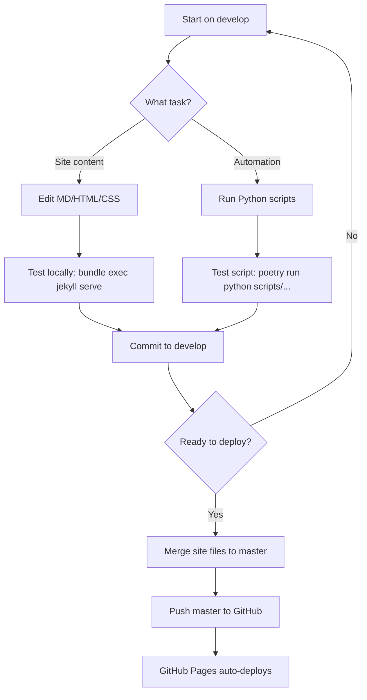
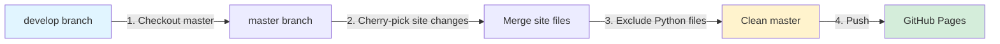

# Git Branch Workflow: Automation + Deployment

**Date:** 2026-02-12  
**Purpose:** Separate Python automation from GitHub Pages deployment

---

## Branch Strategy

```
┌─────────────────────────────────────────────────────────┐
│                    DEVELOP BRANCH                        │
│  ✅ Full development environment                         │
│  ✅ Python automation (scripts/, pyproject.toml)        │
│  ✅ Jekyll site files                                    │
│  ✅ Local testing & development                          │
└─────────────────────────────────────────────────────────┘
                          │
                          │ Selective merge
                          │ (site files only)
                          ▼
┌─────────────────────────────────────────────────────────┐
│                    MASTER BRANCH                         │
│  🚀 GitHub Pages deployment                              │
│  ✅ Jekyll site files only                               │
│  ❌ NO Python files (pyproject.toml, poetry.lock)       │
│  ❌ NO scripts/ directory                                │
└─────────────────────────────────────────────────────────┘
                          │
                          │ Auto-deploy
                          ▼
                  GitHub Pages (Live Site)
```

---

## File Distribution

### DEVELOP Branch (Full Stack)
```
quangphu1912.github.io/
├── _includes/          ✅ Site components
├── _layouts/           ✅ Page templates
├── _projects/          ✅ Project content
├── assets/             ✅ Images, CSS, JS
├── case-studies/       ✅ Case study content
├── scripts/            ✅ Python automation
│   └── images/
│       ├── unsplash_automation.py
│       ├── image_optimizer.py
│       └── metadata.py
├── pyproject.toml      ✅ Python dependencies
├── poetry.lock         ✅ Locked versions
├── .venv/              ✅ Virtual environment
├── _config.yml         ✅ Jekyll config
├── index.md            ✅ Homepage
└── *.md                ✅ Content pages
```

### MASTER Branch (Deployment Only)
```
quangphu1912.github.io/
├── _includes/          ✅ Site components
├── _layouts/           ✅ Page templates
├── _projects/          ✅ Project content
├── assets/             ✅ Images, CSS, JS
├── case-studies/       ✅ Case study content
├── _config.yml         ✅ Jekyll config
├── index.md            ✅ Homepage
├── *.md                ✅ Content pages
└── .gitignore          ✅ Excludes Python files
    (blocks: scripts/, pyproject.toml, poetry.lock)
```

---

## Workflow Diagrams

### Daily Development Workflow



### Selective Merge Process



---

## Commands Reference

### Switch Between Branches

```bash
# Work on automation (develop)
git checkout develop

# Deploy site (master)
git checkout master
```

### Run Automation (develop only)

```bash
# Ensure you're on develop
git checkout develop

# Activate environment
poetry shell

# Run scripts
poetry run python scripts/images/unsplash_automation.py
poetry run python scripts/images/image_optimizer.py
```

### Merge Site Changes to Master

```bash
# Method 1: Selective file merge (recommended)
git checkout master
git checkout develop -- _layouts/ _includes/ _projects/ assets/ case-studies/
git checkout develop -- *.md _config.yml
git commit -m "feat: update site content from develop"
git push origin master

# Method 2: Manual cherry-pick
git checkout master
git cherry-pick <commit-hash>  # Pick specific commits
git push origin master
```

### Test Locally Before Deploy

```bash
# On develop: Test with automation
git checkout develop
bundle exec jekyll serve

# On master: Test deployment version
git checkout master
bundle exec jekyll serve
```

---

## Safety Rules

### ✅ DO
- Keep all automation in `develop`
- Test site locally before merging to `master`
- Merge only site content files to `master`
- Run Python scripts from `develop` branch
- Commit Python dependencies to `develop`

### ❌ DON'T
- Commit Python files to `master`
- Run automation scripts from `master`
- Merge entire `develop` branch to `master`
- Push `scripts/` directory to `master`
- Commit `.venv/` to any branch

---

## Troubleshooting

### GitHub Pages Build Fails

**Symptom:** Build stuck or fails after push to master

**Check:**
```bash
git checkout master
ls -la | grep -E "pyproject|poetry|scripts"
```

**Fix if Python files exist:**
```bash
git rm --cached pyproject.toml poetry.lock
git rm --cached -r scripts/
git commit -m "fix: remove automation from deployment"
git push origin master
```

### Automation Not Working

**Symptom:** Scripts not found or dependencies missing

**Check:**
```bash
git branch --show-current  # Should be 'develop'
ls scripts/                # Should show Python files
poetry env info            # Should show active environment
```

**Fix:**
```bash
git checkout develop
poetry install
poetry shell
```

### Accidentally Committed to Wrong Branch

**Scenario 1: Committed Python files to master**
```bash
git checkout master
git reset --soft HEAD~1    # Undo last commit
git stash                  # Save changes
git checkout develop
git stash pop              # Apply to develop
git add . && git commit -m "fix: move to correct branch"
```

**Scenario 2: Committed site changes to develop (OK)**
```bash
# This is fine! Just merge to master when ready
git checkout master
git checkout develop -- _layouts/ _includes/ *.md
git commit -m "feat: update from develop"
```

---

## Quick Reference Card

| Task | Branch | Command |
|------|--------|---------|
| Edit site content | `develop` or `master` | `vim index.md` |
| Run automation | `develop` | `poetry run python scripts/...` |
| Test site locally | `develop` or `master` | `bundle exec jekyll serve` |
| Deploy to GitHub | `master` | `git push origin master` |
| Install Python deps | `develop` | `poetry install` |
| Add new automation | `develop` | `git add scripts/` |

---

## Architecture Decision

**Why this approach?**

1. **Simplicity:** No complex CI/CD, no subdirectories
2. **GitHub Pages Compatible:** Master branch is clean Jekyll site
3. **Local Automation:** Scripts run locally, no cloud costs
4. **Git History:** Both branches share site history
5. **Flexibility:** Easy to migrate to monorepo later if needed

**Trade-offs:**
- Manual merge process (vs automatic CI/CD)
- Must remember which branch for which task
- Python files duplicated locally (not in Git)

**When to upgrade:**
- Multiple contributors need automation
- Automation needs to run on schedule (cron)
- CI/CD pipeline becomes necessary
- Team grows beyond 1-2 people

---

## Future Improvements

### Phase 1: Current (Manual)
```
develop (local) → manual merge → master → GitHub Pages
```

### Phase 2: GitHub Actions (Future)
```
develop → PR → GitHub Actions → build → gh-pages branch
```

### Phase 3: Monorepo (If Needed)
```
site/ → GitHub Actions → deploy
automation/ → Local or scheduled runs
```

---

**Last Updated:** 2026-02-12  
**Status:** ✅ Active workflow  
**Next Review:** When adding team members or CI/CD
