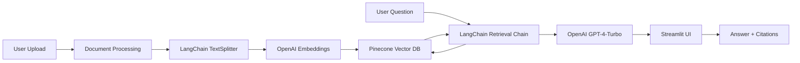

## Context

**Current State**: Portfolio lacks modern ML project diversity. LLMs and RAG (Retrieval-Augmented Generation) are the hottest skills in 2024, but zero LLM experience is visible. Current projects (NLP, data engineering) are solid but don't demonstrate cutting-edge expertise. Adding an LLM/RAG project will modernize portfolio and differentiate from competitors.

**Constraints**:
- Must use cost-effective approach (free tiers, minimal API costs)
- Should demonstrate full-stack understanding (embeddings → vector DB → retrieval → generation → UI)
- Must be working demo, not just prototype
- Should fit within 2-3 week time investment

**Stakeholders**: Portfolio owner (needs to showcase modern skills), recruiters (looking for LLM/RAG experience), collaborators (need to see production-ready implementation)

## Goals / Non-Goals

**Goals:**
- Build complete LLM/RAG application for financial document Q&A
- Demonstrate full-stack ML: embeddings, vector DB, LangChain, LLM orchestration, UI
- Create working demo with real financial documents (earnings reports, SEC filings)
- Write technical blog post on RAG implementation
- Publish GitHub repo with production-quality code
- Add architecture diagram and model card

**Non-Goals:**
- Building custom LLM (use existing models via API)
- Creating production-grade enterprise system (demo/portfolio quality acceptable)
- Optimizing for lowest latency (functional demo is sufficient)
- Handling all edge cases (focus on happy path, document limitations)

## Decisions

**Application: Financial Document Q&A System**
- **Use Case**: Upload financial documents (10-K, 10-Q, earnings transcripts), ask natural language questions, get answers with citations
- **Why this use case**:
  - Demonstrates domain expertise (finance + ML)
  - Real business value (analysts spend hours searching documents)
  - Clear success metrics (answer accuracy, retrieval speed)
  - Visually compelling demo (upload document → ask → see highlighted answer)

**Tech Stack**
- **Decision**: LangChain + OpenAI API + Pinecone + Streamlit
- **Components**:
  - **Document Processing**: LangChain TextSplitter (chunk by 500 chars, 50 char overlap)
  - **Embeddings**: OpenAI text-embedding-ada-002 ($0.0001/1K tokens)
  - **Vector DB**: Pinecone Serverless (free tier: 1M vectors, $0/month)
  - **LLM**: OpenAI GPT-4-Turbo (fast, cost-effective: $0.01/1K tokens)
  - **Orchestration**: LangChain chains (retrieval → generation)
  - **UI**: Streamlit (Python web UI, free on Streamlit Community Cloud)
  - **Evaluation**: RAGAS (faithfulness, answer relevancy metrics)
- **Rationale**: Industry-standard stack, cost-effective, rapid development, production-ready
- **Alternatives considered**:
  - Local LLM (Llama 2 via Ollama) - rejected as lower quality, more complex
  - Weaviate instead of Pinecone - rejected as Pinecone serverless has better free tier
  - Chainlit instead of Streamlit - rejected as Streamlit more mature, better docs

**Architecture**

**Key Features**
1. **Document Ingestion**
   - Upload PDF, TXT, DOCX
   - Chunking: 500 chars, 50 char overlap (preserves context)
   - Store chunks + metadata (doc name, page num) in Pinecone

2. **Question Answering**
   - User query → semantic search in Pinecone (top 5 chunks)
   - Retrieved chunks → GPT-4 with prompt engineering
   - Response with citations (highlight which chunks used)

3. **Cost Tracking**
   - Track OpenAI API costs per query (display to user)
   - Estimate monthly cost based on usage

4. **Evaluation Framework**
   - RAGAS metrics: faithfulness (answer grounded in context), answer relevancy
   - Test set of 20 Q&A pairs from uploaded documents
   - Benchmark results: faithfulness score, relevancy score

**Data Strategy**
- **Decision**: Use publicly available financial documents for demo
  - Apple 2023 10-K (from SEC EDGAR)
  - Tesla Q4 2023 earnings transcript (from investor relations)
  - JPMorgan Chase 2023 Annual Report
- **Rationale**: No IP issues, realistic data, allows compelling demo
- **Alternative**: Synthetic financial documents - rejected as less realistic

**Performance Targets**
- **Retrieval speed**: <500ms for semantic search (Pinecone serverless)
- **End-to-end latency**: <3s (upload → ingest → query → answer)
- **Answer quality**: Faithfulness >0.8, Relevancy >0.85 (RAGAS metrics)
- **Cost**: <$0.10 per 100 queries (OpenAI + Pinecone free tier)

## Risks / Trade-offs

**Risk: OpenAI API costs**
- **Mitigation**:
  - Use GPT-4-Turbo (not GPT-4) - 3x cheaper, similar quality
  - Cache frequent queries (local cache for repeated questions)
  - Set monthly budget limit in OpenAI dashboard
- **Estimated cost**:
  - Embeddings: 100 pages × 2KB = 200KB = ~25K tokens = $0.0025 (one-time)
  - Queries: 100 queries/month × 500 tokens = 50K tokens = $0.50/month
  - Total: ~$0.50/month for demo usage

**Risk: Pinecone free tier limits**
- **Mitigation**:
  - Serverless free tier: 1M vectors, 5K queries (sufficient for demo)
  - Use namespace per document for easy cleanup
  - If exceeded, switch to local ChromaDB (open-source)
- **Threshold**: ~1000 documents × 500 chunks = 500K vectors (within free tier)

**Risk: LLM hallucination**
- **Mitigation**:
  - RAG retrieval grounds answers in documents
  - Citations show source chunks to user
  - System prompt: "If answer not in documents, say I don't know"
  - Evaluate with RAGAS faithfulness metric

**Trade-off: Streamlit vs. FastAPI + React**
- **Analysis**: Streamlit = 1 day to build, FastAPI + React = 5-7 days
- **Decision**: Streamlit for portfolio demo, can rebuild with FastAPI later for production
- **Rationale**: Goal is to demonstrate RAG understanding, not web development skills

**Risk: Answer quality not meeting business needs**
- **Mitigation**:
  - Evaluate with RAGAS test set before publicizing
  - Document limitations in model card
  - Focus on demo quality, not production readiness

## Migration Plan

**Week 1: Infrastructure Setup**
1. Create GitHub repo: quangphu1912/financial-rag-qa
2. Set up Python environment (requirements.txt: langchain, openai, pinecone, streamlit)
3. Get API keys (OpenAI, Pinecone)
4. Set up Pinecone index and namespace
5. Create basic LangChain retrieval chain (hello world)

**Week 2: Core Development**
1. Build document processing pipeline
   - LangChain TextSplitter configuration
   - OpenAI embeddings generation
   - Pinecone upsert with metadata
2. Build Q&A chain
   - RetrievalQA chain setup
   - Prompt engineering for financial context
   - Citation extraction (highlight retrieved chunks)
3. Create Streamlit UI
   - File upload widget
   - Query input
   - Answer + citation display
   - Cost tracker
4. Test with 1-2 documents

**Week 3: Refinement & Documentation**
1. Ingest demo documents (Apple 10-K, Tesla transcript, JPMorgan report)
2. Create evaluation framework
   - RAGAS test set (20 Q&A pairs)
   - Benchmark faithfulness, relevancy
   - Iterate on prompt/chunking if scores <0.8
3. Write comprehensive README
   - Architecture diagram (Mermaid)
   - Setup instructions
   - Usage examples
4. Create model card
   - Model details (GPT-4-Turbo, ada-002)
   - Performance metrics
   - Limitations (e.g., only uploaded documents, not web search)

**Week 4: Integration**
1. Deploy to Streamlit Community Cloud (free hosting)
2. Write blog post: "Building RAG Systems: A Practical Guide"
   - Architecture explanation
   - Code snippets (chunking, retrieval, generation)
   - Lessons learned (chunking strategies, prompt engineering)
   - Performance benchmarks
3. Add to portfolio
   - Create _projects/llm-rag-qa.md
   - Add screenshots (UI, architecture diagram)
   - Link to live demo
4. Test all links, verify demo works

**Rollback Strategy**: New project, no existing content changes. Delete repo/portfolio page if issues.

## Open Questions

- [ ] Should we use local LLM (Llama 2) to avoid API costs? (Recommend: no, use OpenAI for quality, document costs)
- [ ] Should we add web search retrieval (e.g., Tavily) in addition to document retrieval? (Recommend: no, keep focused on RAG)
- [ ] Should we implement multi-document queries (e.g., "compare Apple vs Tesla revenue")? (Recommend: stretch goal, add after core works)
